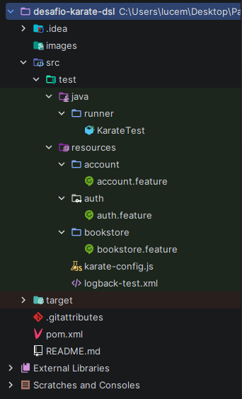

# Desafio Accenture - Automação com Karate DSL

## Projeto

### Automação de testes para API [BookStore](https://bookstore.demoqa.com/swagger/), usando Karate DSL.

#### Nesse projeto tem os endpoints de Account e BookStore, com os cenários de sucesso e falha deles.

## Os Endpoints Automatizados foram 

### Account

* #### POST /Account/v1/User — Criar um usuário

* #### POST /Account/v1/GenerateToken — Gerar o token do usuário

* #### DELETE /Account/v1/User/{UUID} — Deletar o usuário

### BookStore

* #### GET /BookStore/v1/Books — Listar o catálogo dos livros

* #### POST /BookStore/v1/Books — Adicionar um livro a um usuário

* #### GET /BookStore/v1/Book — Buscar um livro por ISBN

* #### PUT /BookStore/v1/Books/{ISBN} — Atualizar o ISBN de um livro

# Cenários Testados

### Testei cenários de sucesso e falha pra cada Endpoint, sao eles:

* #### Criar um usuário com sucesso

* #### Gerar o token para reutilização

* #### Deletar um usuário existente e falha ao deletar o usuário inexistente

* #### Listar o catálogo de livros

* #### Buscar um livro por ISBN (sucesso e falha)

* #### Atualizar o ISBN de livro existente

* #### Adicionar um livro a um usuário (sucesso e falha)

#### Observação: Alguns dos cenários da API BookStore estão dando timeout ou um retorno diferente do esperado (Por exemplo: Atualizar o ISBN do livro retorna status 400 e buscar o ISBN inexistente retorna o status 200). O código dos cenários foi escrito corretamente e foi incluído, mesmo que não esteja executando da forma correta.

# Estrutura do Projeto

 

## Configuração e Execução

* #### 1- Instalar Maven e o Java 21+

* #### 2- Clonar o repositório:
  * git clone https://github.com/LucemyJr/desafio-karate-dsl
  * cd desafio-karate-dsl

* #### 3- Rodar os testes
  * mvn test

#### Para reutilizar token em outras features, eu usei o <u>callonce em auth.feature</u>.

 

## Observações

* #### Alguns cenários dependem da API e podem não retornar exatamente como esperado.

* #### Adicionar um livro a um usuário pode dar timeout por limitação da propria API.

* #### Todos os testes foram organizados por feature e por endpoint.

### Diferenciais implementados

* #### Reaproveitamento do token usando o callonce

* #### Cobertura dos dois GET: catálogo de livros e busca por ISBN

 
 

### Autor

* #### Nome: Lucemy Ferreira da Silveira júnior

* #### Desafio de Karate DSL da Academia QE Accenture

